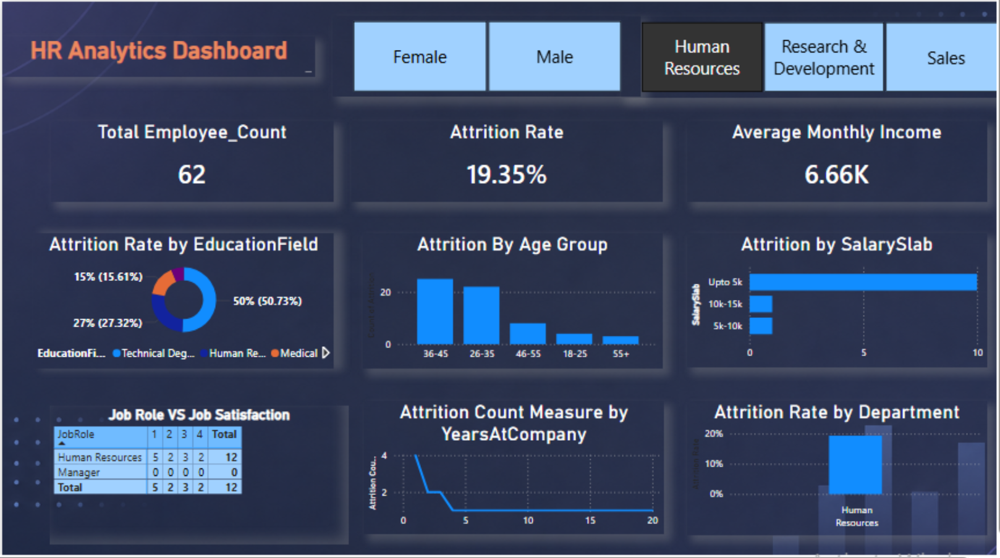

#📊  HR Analytics Dashboard

## 📁 Dataset
- 1,480 employee records
- 38 columns analyzed

This project analyzes HR data to provide insights into workforce trends, employee attrition, and other key HR metrics. The data is visualized using Power BI to help HR professionals make data-driven decisions.

## Project Structure

- **HR_Analytics.csv**: The main dataset containing HR-related information.

**HR Analytics Dashboard – Key Insights**
📊 # **Project Overview**
Developed an interactive HR Analytics Dashboard in Power BI to analyze employee attrition trends, workforce demographics, salary distribution, job satisfaction, and departmental performance. The dashboard helps HR teams identify key factors influencing employee turnover and supports data-driven retention strategies.

🔍 **Key Insights Discovered**
1️⃣ Overall Attrition Rate
The organization shows an attrition rate of approximately 19%, indicating moderate employee turnover.
This suggests that nearly 1 out of every 5 employees has left the organization.

2️⃣ Salary vs Attrition
Employees in the lower salary slabs (Upto 5K) show the highest attrition.
Attrition gradually decreases as salary increases.
This indicates compensation may strongly influence employee retention.

3️⃣ Age Group Analysis
Employees aged 26–35 have the highest attrition count.
Mid-career professionals are more likely to switch jobs for career growth and better opportunities.

4️⃣ Education Field Analysis
Employees from Life Sciences and Medical education backgrounds contribute the highest attrition percentage.
Certain educational domains may experience higher external job opportunities or workplace pressure.

5️⃣ Department-Wise Attrition
Sales and Research & Development departments show comparatively higher attrition.
These departments may require improved employee engagement and retention strategies.

6️⃣ Job Satisfaction Insights
Some job roles such as Sales Executive and Research Scientist display lower job satisfaction levels along with higher attrition.
Employee satisfaction appears directly connected to turnover behavior.

7️⃣ Experience vs Attrition
Attrition is highest during the early years at the company.
Employees with longer tenure are more likely to stay, indicating improved stability over time.

🛠 Tools & Technologies Used
Power BI
DAX (Data Analysis Expressions)
Data Modeling
Interactive Visualizations
KPI Cards
Slicers & Filters

📈 DAX Measures Used
Total Employee Count
Attrition Count
Attrition Rate
Average Monthly Income

🎯 Business Impact
This dashboard enables HR teams to:
Monitor employee turnover trends
Identify high-risk employee groups
Improve retention planning
Support workforce decision-making through data visualization

## How to Use

1. **Explore the Data**: Open the `HR_Analytics.csv` file to review the available HR data.
2. **Power BI Dashboard**: Import the CSV file into Power BI to create interactive dashboards and reports.
3. **Analysis**: Use the dashboard to analyze trends such as attrition rates, department performance, and employee demographics.

## Key Features

- Employee attrition analysis
- Department-wise breakdown
- Demographic insights
- Customizable Power BI visuals

## Requirements

- Power BI Desktop (for dashboard creation and visualization)

## Getting Started

1. Download and install Power BI Desktop from [Microsoft Power BI](https://powerbi.microsoft.com/desktop/).
2. Open Power BI and import the `HR_Analytics.csv` file.
3. Build your own reports or use provided templates (if available).

## License

This project is for educational and portfolio purposes only.
